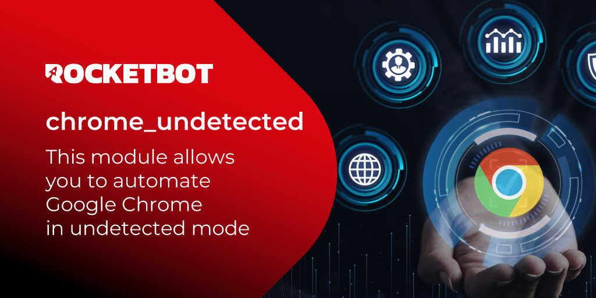

# chrome_undetected
  
Este módulo te permite automatizar Google Chrome en modo undetected  

*Read this in other languages: [English](Manual_chrome_undetected.md), [Português](Manual_chrome_undetected.pr.md), [Español](Manual_chrome_undetected.es.md)*
  

## Como instalar este módulo
  
Para instalar el módulo en Rocketbot Studio, se puede hacer de dos formas:
1. Manual: __Descargar__ el archivo .zip y descomprimirlo en la carpeta modules. El nombre de la carpeta debe ser el mismo al del módulo y dentro debe tener los siguientes archivos y carpetas: \__init__.py, package.json, docs, example y libs. Si tiene abierta la aplicación, refresca el navegador para poder utilizar el nuevo modulo.
2. Automática: Al ingresar a Rocketbot Studio sobre el margen derecho encontrara la sección de **Addons**, seleccionar **Install Mods**, buscar el modulo deseado y presionar install.  

## Como usar este modulo

Este módulo **NO** utiliza los drivers de la ubicación por defecto de Rocketbot, sino que los descarga automáticamente. Por lo tanto, es necesario tener una conexión a internet para poder descargar los drivers. En caso de que el ambiente donde se ejecutará el robot presente bloqueos de red, los siguientes links deben ser habilitados para que la descarga de los drivers sea exitosa:

- https://storage.googleapis.com/* (URL de descarga de los drivers)
- https://googlechromelabs.github.io/chrome-for-testing/* (URL de revisión de la versión de los drivers)

La ruta donde se descargan los drivers es la siguiente:
`C:\Users\<usuario>\.wdm\drivers\chromedriver\win64\<versión>`

## Descripción de los comandos

### Abrir Navegador
  
Abre el navegador seleccionado.
|Parámetros|Descripción|ejemplo|
| --- | --- | --- |
|URL|Direccion a la cual se desea acceder.|https://rocketbot.com/es|
|Puerto|Puerto que usará el navegador|5002|
|Carpeta de perfil (Opcional)|Carpeta de perfil (dejar en blanco si se desea tomar la carpeta por default de rocketbot para pruebas).|C:/Users/Usuario/Desktop/perfil_navegador|

### Cerrar Navegador
  
Cierra el navegador seleccionado.
|Parámetros|Descripción|ejemplo|
| --- | --- | --- |
